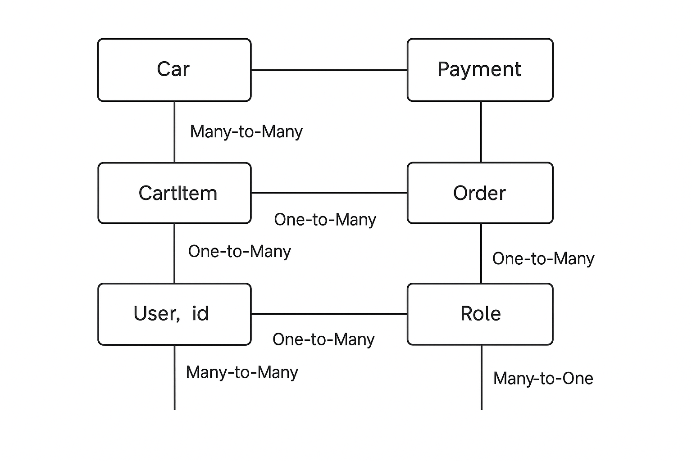

## Table of Contents
1. Project Overview
2. Technologies Used
3. Models and Relations
4. Project Structure
5. Getting Started (Local Run)
6. Challenges
7. Postman Collections
8. Swagger
9. Contacts

## Project Overview
This project is an online car sharing service with Spring Boot.  
It allows administrators to manage cars, and users to browse, rent cars and create payment.  
The application uses JWT authentication for security, supports pagination and sorting, provides an interactive API documentation via Swagger 
and allows users to pay through Stripe API and user will get notification about renting or payment in the chat telegram bot.

## Technologies Used

- **Java 17**
- **Spring Boot**
- **Spring Data JPA**
- **Spring Security**
- **Hibernate**
- **Swagger/OpenAPI**
- **JUnit 5 & Mockito**
- **Maven**
- **MySQL**
- **Stripe API**
- **Telegram Bot API**

## Models and Relations
- Car 
- Payment (Many-to-One with Rental)
- Rental (Many-to-One with Car, Many-to-One with User)
- User (Many-to-Many with Role)
- Role (Many-to-Many with User)

## Features I used in my project
- **Car Management** – CRUD operations for cars with soft delete support.
- **Rental Management** – Create and manage rentals (linked with users and cars).
- **Payment Management** – Integration with Stripe API for rental payments, handling successful and failed transactions.
- **User & Roles** – User system with role-based access (USER, ADMIN).
- **JWT Authentication** – All protected endpoints require a valid Bearer token.
- **Notifications Service** – Send notifications to administrators via Telegram Bot API (new rentals, overdue rentals, successful payments).
- **Pagination & Sorting** – Efficient handling of large datasets.
- **API Documentation** – Interactive Swagger/OpenAPI documentation.
- **Database Migrations** – Managed with Liquibase.
- **Unit & Integration Tests** – JUnit 5 & Mockito for stability and correctness.

## Getting Started (Local Run)
1) Clone the repository
   git clone https://github.com/your-username/your-repo-name.git
   cd your-repo-name

2) Configure the database
   Update src/main/resources/application.properties with your database credentials:

spring.datasource.url=jdbc:mysql://localhost:3306/car_sharing
spring.datasource.username=yourusername
spring.datasource.password=yourpassword

3) Build your project

mvn clean package

4) Configure environment variables
   Copy file `.env.template` to `.env`: cp .env.template .env
   Fill in the values in `.env`.

5) Build and start application

docker-compose up --build or mvn spring-boot:run

8) Access the API

Swagger UI: http://localhost:8084/swagger-ui/index.html
Secured endpoints require a valid Bearer Token in the Authorization header:
Authorization: Bearer <your_token>

## Changes
1) Database migration conflicts – At the beginning, Liquibase migrations caused issues with creating relations between entities (e.g., rentals, users, cars, and payments).
   - Fixed by splitting migrations into smaller files.
   - Adjusted foreign key constraints (Rental → Car, Rental → User, Payment → Rental) to avoid conflicts.

2) JWT authentication & roles – Initial problems with JWT token validation and assigning roles (USER, ADMIN).
   - Solved by creating a custom JWT filter.
   - Added integration tests to verify role-based access for protected endpoints.

3) Car availability & rentals filtering – Implementing business logic for checking car availability and retrieving active/overdue rentals was tricky.
   - Solved using Spring Data JPA Criteria API with dynamic filtering.
   - Optimized queries to handle multiple filtering options (by user, car, rental status).

4) Payments integration – Stripe API integration for handling payments initially failed due to incorrect webhook handling.
   - Fixed by properly verifying Stripe events.

5) Testing – Faced problems with cleaning the database between tests (foreign keys blocked truncation).
   - Solved by disabling constraints during tests and truncating all tables.

## Postman Collections
In each request you need to use Authentication through Bearer token, so before each request login into system
and remember that this token is valid for 50 minutes then you will need to re-login in order to get new token
and remember that if you send request to add, delete, update your user need to have role Admin

1.Car
1) POST request - http://localhost:8084/api/cars - you will create a new car by given params in json(admin only)
2) GET request - http://localhost:8084/api/cars - you will get all existing cars in the service
3) GET request - http://localhost:8084/api/cars/search?type=SEDAN - you will get all existing cars with filter by given params in the url(type of the car must be 'SEDAN')
4) PATCH request - http://localhost:8084/api/cars/1 - you will update a car by id and params what you want to change in json(in url id = 1)(admin only)
5) DELETE request - http://localhost:8084/api/cars/1 - you will delete car by id(in url id = 1)(admin only)

2.Rental
1) POST request - http://localhost:8084/api/rentals - you will create rental by given params in json
2) GET request - http://localhost:8084/api/rentals/1 - you will get rental by rental id and only these rentals which this user had before(in url rental id = 1)
3) GET request - http://localhost:8084/api/rentals/1/rentals - you will get all your active or not active rentals by given this information in json format
4) POST request - http://localhost:8084/api/rentals/return - you will return car which you rented before, you need to send rental ids in json format

3.Payment
1) POST request - http://localhost:8084/api/payment - you will create a new payment in order to pay for rental in json you need to send type of payment and rental id for what you want to pay
2) GET request - http://localhost:8084/api/payment/1 - you will get user's payment by id (in url payment id = 1)
3) GET request - http://localhost:8084/api/payment/success?sessionId=cs_test_a1IKNt0COMCX9m9aawNPOGRP10lFH9SvESORSmN1mRD8n5duuWBfw8mNX0o - this endpoint is created to redirect user in case od successful payment (in url must be individual session id)
4) GET request - http://localhost:8084/api/payment/cancel?sessionId=cs_test_a1IKNt0COMCX9m9aawNPOGRP10lFH9SvESORSmN1mRD8n5duuWBfw8mNX0 - this endpoint is created to redirect user in case od canceled payment (in url must be individual session id)

4.ShoppingCart
1) GET request - http://localhost:8082/api/cart - you will get shopping cart for user
2) POST request - http://localhost:8082/api/cart - you need to send body with params in json and then you will get shopping cart which was saved to database
3) PUT request - http://localhost:8082/api/cart/items/2 - you need to send body with params in json and then you will get updated shopping cart which was updated in database
4) DELETE request - http://localhost:8082/api/cart/items/2 - you will delete cart item in shopping cart by id(in url id = 2)
   [Download Shopping Cart Postman Collection](postman-requests/ShoppingCart.postman_collection.json)

5.User
1) POST request - http://localhost:8082/api/auth/registration - you need to send body with params in json and then you will get user which was saved to database
2) POST request - http://localhost:8083/api/auth/login - you need to send credentials for login(username and password) and then you will get jwt token which you need to send all requests
   [Download User Postman Collection](postman-requests/User.postman_collection.json)

## Swagger
The API is documented using Swagger/OpenAPI and is available at:
- `http://localhost:8082/swagger-ui/index.html`

## Contacts
- Author: Mykola
- Email: nikolya.cr@email.com
- GitHub: [Nikolya777777777777](https://github.com/Nikolya777777777777)
